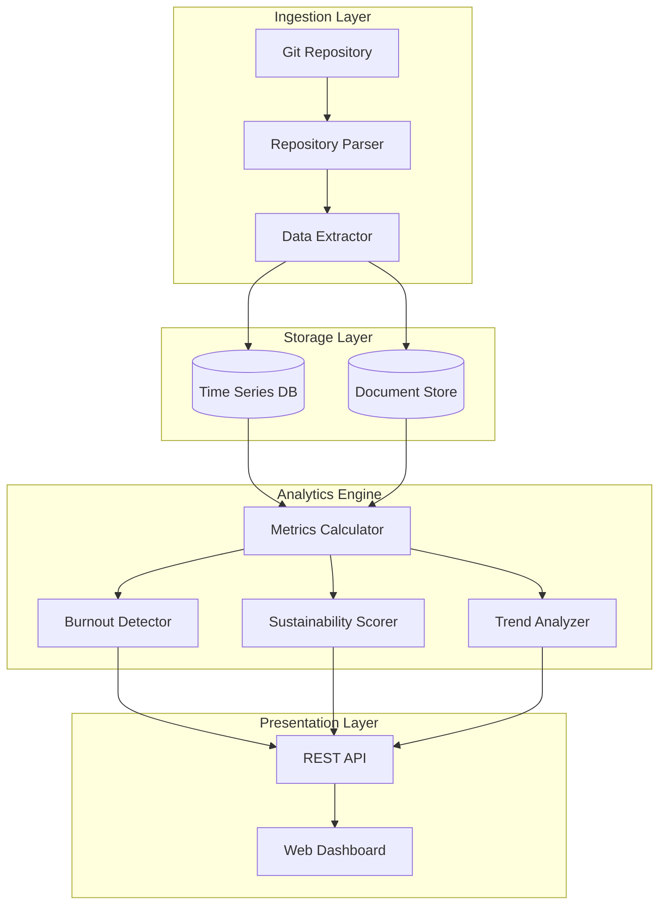

# Design Document: SustainOSS

## Overview

SustainOSS is an open-source analytics platform that transforms Git repository data into actionable sustainability insights. The system consists of four main layers:

1. **Ingestion Layer**: Extracts data from Git repositories
2. **Analytics Engine**: Computes metrics, detects patterns, and calculates scores
3. **Storage Layer**: Persists raw data and computed metrics
4. **Presentation Layer**: Provides web dashboard and REST API

The design prioritizes:
- **Privacy**: All data processing happens locally, no external transmission
- **Extensibility**: Modular architecture allows adding new metrics easily
- **Performance**: Incremental processing avoids re-analyzing entire history
- **Self-hosting**: Standard deployment with minimal dependencies

## Architecture



### Design Rationale

**Time Series Database**: Metrics are inherently time-based. Using a time series DB (e.g., InfluxDB, TimescaleDB) optimizes for:
- Efficient storage of timestamped metrics
- Fast range queries for trend analysis
- Built-in downsampling for historical data

**Document Store**: Repository metadata (commits, PRs, issues) has variable structure. A document store (e.g., MongoDB, PostgreSQL with JSONB) provides:
- Flexible schema for different Git platforms
- Efficient querying by author, date, status
- Easy incremental updates

**Separation of Concerns**: The four-layer architecture ensures:
- Ingestion can be swapped (GitHub, GitLab, local Git)
- Analytics algorithms can evolve independently
- Presentation can support multiple interfaces (web, CLI, API)

## Components and Interfaces

### 1. Repository Parser

**Responsibility**: Clone and parse Git repositories to extract raw data.

**Interface**:
```
class RepositoryParser:
    def clone_repository(url: str, credentials: Optional[Credentials]) -> Repository
    def get_commits(repo: Repository, since: datetime) -> List[Commit]
    def get_pull_requests(repo: Repository, since: datetime) -> List[PullRequest]
    def get_issues(repo: Repository, since: datetime) -> List[Issue]
    def update_repository(repo: Repository) -> UpdateResult
```

**Implementation Notes**:
- Use `libgit2` or `GitPython` for Git operations
- Support both local paths and remote URLs
- Handle authentication (SSH keys, tokens)
- Implement incremental fetching using last sync timestamp
- For GitHub/GitLab, use their APIs to get PR/issue data (Git doesn't store these)

### 2. Data Extractor

**Responsibility**: Transform raw Git data into structured records for storage.

**Interface**:
```
class DataExtractor:
    def extract_commit_data(commit: GitCommit) -> CommitRecord
    def extract_pr_data(pr: PullRequest) -> PRRecord
    def extract_issue_data(issue: Issue) -> IssueRecord
    def identify_maintainers(repo: Repository) -> List[Maintainer]
```

**Data Models**:
```
CommitRecord:
    - sha: string
    - author: string
    - author_email: string
    - timestamp: datetime
    - files_changed: int
    - insertions: int
    - deletions: int
    - message: string

PRRecord:
    - id: string
    - author: string
    - reviewers: List[string]
    - created_at: datetime
    - merged_at: Optional[datetime]
    - closed_at: Optional[datetime]
    - review_comments: int
    - files_changed: int
    - status: enum(open, merged, closed)

IssueRecord:
    - id: string
    - author: string
    - assignees: List[string]
    - labels: List[string]
    - created_at: datetime
    - closed_at: Optional[datetime]
    - first_response_at: Optional[datetime]
    - comment_count: int
    - status: enum(open, closed)

Maintainer:
    - name: string
    - email: string
    - role: enum(owner, maintainer, contributor)
```

**Maintainer Identification**:
- Parse CODEOWNERS file if present
- Identify users with merge commits
- Identify users who review PRs
- Allow manual configuration override

### 3. Metrics Calculator

**Responsibility**: Compute load and activity metrics from stored data.

**Interface**:
```
class MetricsCalculator:
    def calculate_pr_reviews_per_maintainer(
        repo_id: string, 
        time_period: TimePeriod
    ) -> Dict[string, int]
    
    def calculate_open_issues_per_maintainer(
        repo_id: string
    ) -> Dict[string, int]
    
    def calculate_avg_review_turnaround(
        repo_id: string,
        time_period: TimePeriod
    ) -> Dict[string, float]  # maintainer -> hours
    
    def calculate_contribution_concentration(
        repo_id: string,
        time_period: TimePeriod
    ) -> float  # Gini coefficient (0-1)
    
    def calculate_contributor_diversity(
        repo_id: string,
        time_period: TimePeriod
    ) -> int  # unique contributors
    
    def calculate_retention_ratio(
        repo_id: string,
        time_period: TimePeriod
    ) -> float  # percentage (0-100)
```

**Metric Definitions**:

1. **PR Reviews Per Maintainer**: Count of PRs where maintainer left review comments or approved/merged
2. **Open Issues Per Maintainer**: Count of currently open issues assigned to maintainer
3. **Avg Review Turnaround**: Mean time from PR creation to first review by maintainer
4. **Contribution Concentration**: Gini coefficient of commit distribution (0 = perfectly equal, 1 = one person does everything)
5. **Contributor Diversity**: Count of unique contributors in time period
6. **Retention Ratio**: (Contributors with 2+ contributions) / (Total contributors) × 100

### 4. Burnout Detector

**Responsibility**: Analyze metrics to identify burnout risk indicators.

**Interface**:
```
class BurnoutDetector:
    def detect_high_load_concentration(
        repo_id: string,
        time_period: TimePeriod
    ) -> List[BurnoutAlert]
    
    def detect_increasing_backlog(
        repo_id: string
    ) -> Optional[BurnoutAlert]
    
    def detect_declining_responsiveness(
        repo_id: string
    ) -> List[BurnoutAlert]
    
    def detect_untriaged_issues(
        repo_id: string
    ) -> Optional[BurnoutAlert]
    
    def calculate_overall_risk(
        alerts: List[BurnoutAlert]
    ) -> RiskLevel  # enum(low, medium, high)
```

**Alert Model**:
```
BurnoutAlert:
    - type: enum(high_load, increasing_backlog, declining_responsiveness, untriaged_issues)
    - severity: enum(low, medium, high)
    - affected_maintainers: List[string]
    - metric_value: float
    - threshold: float
    - message: string
    - timestamp: datetime
```

**Detection Algorithms**:

1. **High Load Concentration**:
   - Calculate each maintainer's percentage of total activity
   - Alert if any maintainer > 60% threshold
   - Severity: high if > 75%, medium if > 60%

2. **Increasing Backlog**:
   - Compare current open issue count to 30 days ago
   - Alert if increase > 50%
   - Severity: high if > 100% increase, medium if > 50%

3. **Declining Responsiveness**:
   - Calculate current avg response time
   - Compare to 90-day historical baseline
   - Alert if increase > 40%
   - Severity: high if > 100% slower, medium if > 40%

4. **Untriaged Issues**:
   - Find issues with no assignee and no comments
   - Alert if any issue > 14 days old
   - Severity: high if > 30 days, medium if > 14 days

5. **Overall Risk Level**:
   - Low: 0-1 medium alerts, 0 high alerts
   - Medium: 2+ medium alerts OR 1 high alert
   - High: 2+ high alerts

### 5. Sustainability Scorer

**Responsibility**: Calculate composite sustainability index.

**Interface**:
```
class SustainabilityScorer:
    def calculate_sustainability_index(
        repo_id: string,
        time_period: TimePeriod
    ) -> SustainabilityScore
```

**Score Model**:
```
SustainabilityScore:
    - overall_score: float  # 0-100
    - contributor_diversity_score: float  # 0-25
    - load_distribution_score: float  # 0-25
    - response_time_score: float  # 0-25
    - retention_score: float  # 0-25
    - missing_metrics: List[string]
    - timestamp: datetime
```

**Scoring Algorithm**:

Each component contributes 25 points to the overall score:

1. **Contributor Diversity Score** (0-25):
   - Count unique contributors in past 90 days
   - Score = min(25, contributor_count / 2)
   - Rationale: 50+ contributors = maximum diversity

2. **Load Distribution Score** (0-25):
   - Calculate Gini coefficient of activity distribution
   - Score = 25 × (1 - gini_coefficient)
   - Rationale: Lower Gini = more equal distribution = higher score

3. **Response Time Score** (0-25):
   - Calculate median time to first response (issues + PRs)
   - Score = 25 × max(0, 1 - (median_hours / 168))
   - Rationale: < 1 week response time = good, > 1 week = declining score

4. **Retention Score** (0-25):
   - Calculate retention ratio (see Metrics Calculator)
   - Score = retention_ratio × 0.25
   - Rationale: Direct mapping of percentage to score

**Overall Score** = sum of component scores (0-100)

**Handling Missing Metrics**:
- If a component cannot be calculated, distribute its 25 points proportionally to available components
- Track which metrics are missing in the response
- Example: If retention cannot be calculated, other three components each contribute 33.33 points

### 6. Trend Analyzer

**Responsibility**: Track metric changes over time and identify significant trends.

**Interface**:
```
class TrendAnalyzer:
    def store_snapshot(
        repo_id: string,
        metrics: Dict[string, float],
        timestamp: datetime
    ) -> None
    
    def get_trend(
        repo_id: string,
        metric_name: string,
        time_range: TimeRange
    ) -> TrendData
    
    def detect_significant_changes(
        repo_id: string,
        metric_name: string,
        comparison_period: TimePeriod
    ) -> Optional[TrendAlert]
```

**Trend Model**:
```
TrendData:
    - metric_name: string
    - data_points: List[DataPoint]
    - trend_direction: enum(increasing, decreasing, stable)
    - change_percentage: float
    
DataPoint:
    - timestamp: datetime
    - value: float

TrendAlert:
    - metric_name: string
    - change_percentage: float
    - direction: enum(increase, decrease)
    - current_value: float
    - previous_value: float
    - is_significant: bool  # > 30% change
```

**Implementation**:
- Store weekly snapshots of all metrics
- Use time series database for efficient storage and querying
- Calculate trend direction using linear regression over data points
- Flag changes > 30% as significant

### 7. Good First Issue Analyzer

**Responsibility**: Identify issues suitable for new contributors.

**Interface**:
```
class GoodFirstIssueAnalyzer:
    def analyze_issue_complexity(
        issue: IssueRecord,
        repo_history: RepositoryHistory
    ) -> ComplexityScore
    
    def analyze_issue_clarity(
        issue: IssueRecord
    ) -> ClarityScore
    
    def recommend_good_first_issues(
        repo_id: string,
        limit: int
    ) -> List[IssueRecommendation]
```

**Recommendation Model**:
```
IssueRecommendation:
    - issue_id: string
    - title: string
    - complexity_score: float  # 0-100, lower = simpler
    - clarity_score: float  # 0-100, higher = clearer
    - overall_score: float  # 0-100
    - justification: string
    - labels: List[string]

ComplexityScore:
    - score: float
    - factors: Dict[string, float]  # file_count, avg_lines_changed, etc.

ClarityScore:
    - score: float
    - factors: Dict[string, float]  # description_length, has_reproduction, etc.
```

**Scoring Algorithm**:

**Complexity Score** (lower is better):
- Base score: 50
- Subtract 10 for each similar closed issue (indicates common pattern)
- Add 5 for each file typically modified in similar issues
- Add 10 if avg lines changed in similar issues > 100
- Clamp to 0-100

**Clarity Score** (higher is better):
- Base score: 50
- Add 20 if description > 200 characters
- Add 15 if contains code blocks or reproduction steps
- Add 15 if has labels
- Clamp to 0-100

**Overall Score**:
- overall_score = (100 - complexity_score) × 0.5 + clarity_score × 0.5
- Recommend issues with overall_score > 60
- Sort by overall_score descending

### 8. REST API

**Responsibility**: Expose metrics and insights via HTTP endpoints.

**Endpoints**:

```
GET /api/v1/repositories
    - List all tracked repositories
    - Response: List[RepositorySummary]

POST /api/v1/repositories
    - Add a new repository to track
    - Body: { url: string, credentials: Optional[Credentials] }
    - Response: Repository

GET /api/v1/repositories/{repo_id}/metrics
    - Get current metrics for a repository
    - Query params: time_period (7d, 30d, 90d, 1y)
    - Response: MetricsSummary

GET /api/v1/repositories/{repo_id}/burnout
    - Get burnout risk indicators
    - Response: BurnoutReport

GET /api/v1/repositories/{repo_id}/sustainability
    - Get sustainability index
    - Query params: time_period
    - Response: SustainabilityScore

GET /api/v1/repositories/{repo_id}/trends
    - Get historical trend data
    - Query params: metric_name, time_range
    - Response: TrendData

GET /api/v1/repositories/{repo_id}/good-first-issues
    - Get recommended good first issues
    - Query params: limit (default 10)
    - Response: List[IssueRecommendation]

POST /api/v1/repositories/{repo_id}/sync
    - Trigger repository data sync
    - Response: SyncStatus
```

**Authentication**:
- Use API key authentication (header: `X-API-Key`)
- Generate API keys via configuration or admin interface
- Store hashed keys in database

**Error Handling**:
- 400 Bad Request: Invalid parameters
- 401 Unauthorized: Missing or invalid API key
- 404 Not Found: Repository not found
- 500 Internal Server Error: Processing error
- Include error message in response body: `{ error: string, details: Optional[string] }`

### 9. Web Dashboard

**Responsibility**: Provide visual interface for exploring repository health.

**Pages**:

1. **Repository List**:
   - Table of tracked repositories
   - Columns: Name, Sustainability Score, Burnout Risk, Last Updated
   - Actions: Add Repository, View Details, Sync

2. **Repository Dashboard**:
   - Overview cards: Sustainability Score, Burnout Risk, Active Maintainers, Open Issues
   - Load Distribution chart (bar chart: maintainer vs PR reviews)
   - Burnout Alerts panel (list of active alerts)
   - Trend graphs (line charts for key metrics over time)
   - Time period selector (7d, 30d, 90d, 1y)

3. **Maintainer Details**:
   - Individual maintainer metrics
   - PR review count, avg turnaround time, assigned issues
   - Activity timeline
   - Burnout risk indicator

4. **Good First Issues**:
   - Table of recommended issues
   - Columns: Title, Complexity, Clarity, Overall Score, Justification
   - Link to issue on Git platform

**Technology Stack**:
- Frontend: React or Vue.js (lightweight, component-based)
- Charts: Chart.js or D3.js
- Styling: Tailwind CSS (utility-first, minimal bundle)
- Build: Vite (fast, modern)

**Design Principles**:
- Mobile-responsive
- Accessible (WCAG 2.1 AA)
- Fast loading (< 2s initial load)
- Clear visual hierarchy
- Color-blind friendly palette

## Data Models

### Storage Schema

**Time Series Database (InfluxDB/TimescaleDB)**:

```
measurement: repository_metrics
tags:
    - repo_id
    - metric_name
    - maintainer (optional, for per-maintainer metrics)
fields:
    - value (float)
timestamp: datetime

Examples:
- repo_id=123, metric_name=pr_reviews, maintainer=alice, value=15, time=2024-01-15
- repo_id=123, metric_name=sustainability_score, value=72.5, time=2024-01-15
```

**Document Store (MongoDB/PostgreSQL)**:

```
Collection: repositories
{
    _id: string,
    url: string,
    name: string,
    last_sync: datetime,
    maintainers: List[Maintainer],
    created_at: datetime
}

Collection: commits
{
    _id: string,
    repo_id: string,
    sha: string,
    author: string,
    author_email: string,
    timestamp: datetime,
    files_changed: int,
    insertions: int,
    deletions: int,
    message: string
}

Collection: pull_requests
{
    _id: string,
    repo_id: string,
    pr_id: string,
    author: string,
    reviewers: List[string],
    created_at: datetime,
    merged_at: Optional[datetime],
    closed_at: Optional[datetime],
    review_comments: int,
    files_changed: int,
    status: string
}

Collection: issues
{
    _id: string,
    repo_id: string,
    issue_id: string,
    author: string,
    assignees: List[string],
    labels: List[string],
    created_at: datetime,
    closed_at: Optional[datetime],
    first_response_at: Optional[datetime],
    comment_count: int,
    status: string,
    title: string,
    description: string
}

Collection: burnout_alerts
{
    _id: string,
    repo_id: string,
    type: string,
    severity: string,
    affected_maintainers: List[string],
    metric_value: float,
    threshold: float,
    message: string,
    timestamp: datetime,
    resolved: bool
}
```

## Correctness Properties

*A property is a characteristic or behavior that should hold true across all valid executions of a system—essentially, a formal statement about what the system should do. Properties serve as the bridge between human-readable specifications and machine-verifiable correctness guarantees.*


### Property 1: Repository Cloning Success
*For any* valid Git repository URL, the Ingestion Layer should successfully clone the repository and extract commit history without errors.
**Validates: Requirements 1.1**

### Property 2: Complete Data Field Extraction
*For any* extracted record (commit, PR, or issue), all required fields specified in the data model should be present and non-null.
**Validates: Requirements 1.2, 1.3, 1.4**

### Property 3: Incremental Update Efficiency
*For any* repository that has been previously synced, a subsequent sync should only process commits, PRs, and issues created after the last sync timestamp.
**Validates: Requirements 1.5**

### Property 4: Invalid Repository Error Handling
*For any* invalid or inaccessible repository URL, the Ingestion Layer should return a descriptive error message without crashing.
**Validates: Requirements 1.6**

### Property 5: Metric Calculation Correctness
*For any* repository data and time period, calculated metrics (PR reviews per maintainer, open issues per maintainer, average turnaround time) should match manual computation from the same data.
**Validates: Requirements 2.1, 2.2, 2.3**

### Property 6: Gini Coefficient Bounds
*For any* activity distribution, the calculated contribution concentration index (Gini coefficient) should be between 0 and 1 inclusive.
**Validates: Requirements 2.4**

### Property 7: Inactive Maintainer Inclusion
*For any* maintainer with zero activity in a time period, the metrics report should include that maintainer with zero values rather than omitting them.
**Validates: Requirements 2.6**

### Property 8: High Load Concentration Detection
*For any* repository where a maintainer handles more than 60% of total activity, the Burnout Detector should flag that maintainer as high burnout risk.
**Validates: Requirements 3.1**

### Property 9: Backlog Increase Detection
*For any* repository where the open issue count increases by more than 50% over 30 days, the Burnout Detector should flag an increasing backlog trend.
**Validates: Requirements 3.2**

### Property 10: Responsiveness Decline Detection
*For any* repository where average review responsiveness decreases by more than 40% compared to the 90-day baseline, the Burnout Detector should flag declining responsiveness.
**Validates: Requirements 3.3**

### Property 11: Untriaged Issue Detection
*For any* repository with issues that have no assignee, no comments, and are older than 14 days, the Burnout Detector should flag long untriaged issue streaks.
**Validates: Requirements 3.4**

### Property 12: Burnout Risk Aggregation
*For any* set of burnout alerts, the overall risk level should be correctly calculated as: low (0-1 medium, 0 high), medium (2+ medium OR 1 high), high (2+ high).
**Validates: Requirements 3.5**

### Property 13: Dashboard Data Completeness
*For any* repository metrics, the rendered dashboard should include all required visualizations (PR reviews chart, open issues chart, turnaround time chart) with correct data.
**Validates: Requirements 4.1, 4.2, 4.3**

### Property 14: High Load Visual Highlighting
*For any* maintainer with load above the high-load threshold, the dashboard visualization should include color coding to distinguish them from normal-load maintainers.
**Validates: Requirements 4.4**

### Property 15: Contributor Diversity Calculation
*For any* repository and 90-day time period, the contributor diversity count should equal the number of unique contributors (by email or username) in that period.
**Validates: Requirements 5.1**

### Property 16: Load Distribution Score Calculation
*For any* activity distribution, the load distribution score should be calculated as 25 × (1 - gini_coefficient) and be between 0 and 25.
**Validates: Requirements 5.2**

### Property 17: Response Time Score Calculation
*For any* median response time, the response time score should be calculated as 25 × max(0, 1 - (median_hours / 168)) and be between 0 and 25.
**Validates: Requirements 5.3**

### Property 18: Retention Ratio Calculation
*For any* repository and time period, the retention ratio should equal (contributors with 2+ contributions) / (total contributors) × 100.
**Validates: Requirements 5.4**

### Property 19: Sustainability Index Bounds and Composition
*For any* repository, the Sustainability Index should be between 0 and 100, and should equal the sum of the four component scores (diversity, load distribution, response time, retention).
**Validates: Requirements 5.5**

### Property 20: Graceful Metric Degradation
*For any* sustainability calculation with missing component metrics, the overall score should be computed from available components, redistributing the missing component's weight proportionally, and the response should list which metrics are missing.
**Validates: Requirements 5.6**

### Property 21: Historical Snapshot Storage
*For any* repository being tracked, after 7 days have passed, at least one weekly snapshot of all metrics should exist in the time series database.
**Validates: Requirements 6.1**

### Property 22: Trend Graph Data Inclusion
*For any* repository with historical data, the rendered trend graph should include data points for all available snapshots in the selected time range.
**Validates: Requirements 6.2**

### Property 23: Significant Change Highlighting
*For any* metric with a change greater than 30% between two time periods, the dashboard should visually highlight this change in the trend display.
**Validates: Requirements 6.3**

### Property 24: Issue Complexity Scoring
*For any* issue, the complexity score should be calculated based on file count, average lines changed in similar issues, and comment count, and should be between 0 and 100.
**Validates: Requirements 7.1**

### Property 25: Issue Clarity Scoring
*For any* issue, the clarity score should be calculated based on description length and presence of reproduction steps, and should be between 0 and 100.
**Validates: Requirements 7.2**

### Property 26: Good First Issue Recommendation Threshold
*For any* issue with an overall score (combining complexity and clarity) greater than 60, it should be included in the good first issue recommendations.
**Validates: Requirements 7.3, 7.4**

### Property 27: Recommendation Justification Completeness
*For any* recommended good first issue, the dashboard should display the issue title, complexity score, clarity score, overall score, and a justification string.
**Validates: Requirements 7.5**

### Property 28: API JSON Response Format
*For any* successful API request, the response should be valid JSON that can be parsed without errors.
**Validates: Requirements 8.5**

### Property 29: API Error Response Format
*For any* API request with invalid parameters, the response should include an appropriate HTTP error code (400, 401, 404, 500) and a JSON body with an error message.
**Validates: Requirements 8.6**

### Property 30: Local Data Storage
*For any* repository analysis operation, no network requests should be made to external services (excluding the Git repository itself).
**Validates: Requirements 10.1, 10.3**

### Property 31: Credential Encryption at Rest
*For any* stored repository credentials, the stored value should be encrypted and should not match the plaintext credential.
**Validates: Requirements 10.4**

### Property 32: Security Header Presence
*For any* dashboard HTTP response, standard security headers (HTTPS enforcement, CSRF tokens, XSS protection headers) should be present.
**Validates: Requirements 10.5**

## Error Handling

### Error Categories

1. **Input Validation Errors**:
   - Invalid repository URLs
   - Malformed API requests
   - Invalid time period specifications
   - Return 400 Bad Request with descriptive message

2. **Authentication Errors**:
   - Missing API keys
   - Invalid credentials
   - Expired tokens
   - Return 401 Unauthorized

3. **Resource Not Found Errors**:
   - Repository not tracked
   - Metric not available
   - Return 404 Not Found

4. **External Service Errors**:
   - Git clone failures
   - Network timeouts
   - GitHub/GitLab API rate limits
   - Retry with exponential backoff (3 attempts)
   - Return 503 Service Unavailable if all retries fail

5. **Data Processing Errors**:
   - Corrupt repository data
   - Missing required fields
   - Calculation errors
   - Log error details
   - Return 500 Internal Server Error
   - Include error ID for debugging

6. **Storage Errors**:
   - Database connection failures
   - Disk space exhaustion
   - Write failures
   - Retry once
   - Return 500 Internal Server Error if retry fails

### Error Response Format

All API errors follow this structure:
```json
{
    "error": "Brief error description",
    "details": "Detailed error message (optional)",
    "error_id": "unique-error-identifier",
    "timestamp": "2024-01-15T10:30:00Z"
}
```

### Logging Strategy

- **Info**: Successful operations, sync completions
- **Warning**: Retryable errors, rate limit approaches
- **Error**: Failed operations, data inconsistencies
- **Debug**: Detailed processing steps (disabled in production)

Log format:
```
[timestamp] [level] [component] [repo_id] message
```

### Graceful Degradation

When components fail:
- **Ingestion failure**: Display last successful sync data, show sync error banner
- **Metric calculation failure**: Show available metrics, indicate which are unavailable
- **Database unavailable**: Return cached data if available, otherwise return 503
- **Dashboard rendering error**: Show error boundary with option to reload

## Testing Strategy

### Dual Testing Approach

SustainOSS will use both unit tests and property-based tests to ensure comprehensive coverage:

**Unit Tests**: Focus on specific examples, edge cases, and integration points:
- Specific repository parsing scenarios (empty repos, large repos, repos with unusual structures)
- Edge cases in metric calculations (zero activity, single maintainer, all maintainers equal)
- Error conditions (network failures, invalid data, missing fields)
- API endpoint integration (request/response handling, authentication)
- Dashboard component rendering (specific UI states)

**Property-Based Tests**: Verify universal properties across all inputs:
- All correctness properties defined above
- Each property test will run minimum 100 iterations
- Tests will use randomized inputs to explore the input space
- Each test will be tagged with: **Feature: sustainoss, Property {number}: {property_text}**

### Property-Based Testing Library

**For Python implementation**: Use `hypothesis` library
**For TypeScript implementation**: Use `fast-check` library
**For other languages**: Select appropriate PBT library for the target language

### Test Configuration

Each property-based test must:
- Run minimum 100 iterations (configured in test setup)
- Reference its design document property in a comment
- Use appropriate generators for input data (repositories, commits, PRs, issues, maintainers)
- Include shrinking to find minimal failing examples

Example test structure:
```python
# Feature: sustainoss, Property 6: Gini Coefficient Bounds
@given(activity_distribution=st.lists(st.floats(min_value=0)))
@settings(max_examples=100)
def test_gini_coefficient_bounds(activity_distribution):
    gini = calculate_gini_coefficient(activity_distribution)
    assert 0 <= gini <= 1
```

### Test Coverage Goals

- Unit test coverage: > 80% line coverage
- Property test coverage: All 32 correctness properties implemented
- Integration test coverage: All API endpoints, all dashboard pages
- End-to-end test coverage: Complete user workflows (add repo, view metrics, sync)

### Testing Priorities

1. **Critical path**: Data ingestion → metric calculation → display (must work)
2. **Security**: Authentication, authorization, data privacy (must be secure)
3. **Correctness**: All metric calculations (must be accurate)
4. **Reliability**: Error handling, graceful degradation (must not crash)
5. **Performance**: Large repository handling, query optimization (should be fast)

### Continuous Testing

- Run unit tests on every commit
- Run property tests on every pull request
- Run integration tests before deployment
- Run end-to-end tests weekly on production-like environment
- Monitor test execution time and optimize slow tests
